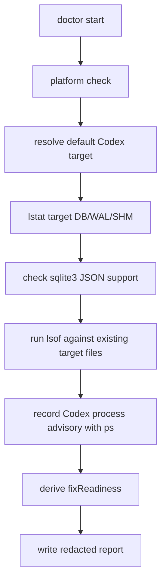
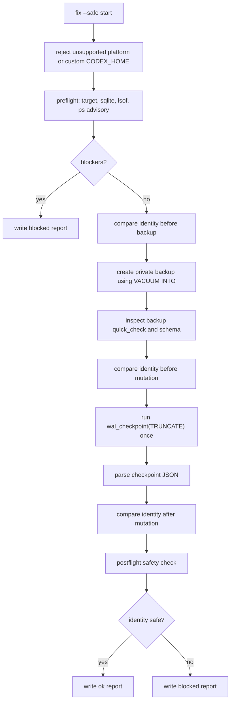

# AIDM レビュワーブリーフ

この文書は、外部レビュワーが `ai-dev-maintenance`、および短縮コマンド `aidm` の目的・機能・安全設計・技術実装を高解像度にレビューできるようにまとめたものです。

対象バージョン: `0.1.5`

## 1. AIDMの目的

`ai-dev-maintenance` は、AIコーディングツールがローカルに作成する状態ファイルによって増えたディスク使用量を、安全に診断・回収するためのmacOS向けCLIです。

v0.1.xでは、対象を意図的に狭くしています。現在の主対象は、CodexのSQLiteログDBです。

```text
<home>/.codex/logs_2.sqlite
<home>/.codex/logs_2.sqlite-wal
<home>/.codex/logs_2.sqlite-shm
```

主な目的は、ユーザーがSQLiteやWAL、open handle、バックアップ検証を理解していなくても、以下を安全に判断できるようにすることです。

- いまCodexログDBがどれくらい肥大化しているか
- cleanupを実行できる安全な状態か
- 実行した場合に何が変わるのか
- 実行してはいけない状態ではなぜ止まるのか

設計上の最重要方針は次です。

> セッション履歴や会話状態を失うリスクを取らず、診断を先に行い、安全が確認できる場合だけWAL checkpoint/truncateを実行する。

## 2. 現在のスコープ

v0.1.xは、汎用ディスククリーナーではありません。

できること:

- CodexログDBとWAL/SHM sidecarの存在・サイズ・安全性を診断する
- 伏せ字済みのローカルレポートを作成する
- Codexが閉じられていて、DB open handleがない場合だけ `fix --safe` を実行する
- `fix --safe` 実行前にローカルprivate backupを作成する
- SQLite `wal_checkpoint(TRUNCATE)` によりWAL領域を回収する
- 実行前後のWALサイズと回収量を表示・記録する

やらないこと:

- log row削除
- chat/session履歴削除
- DB本文やログ本文の表示
- ローカルデータのアップロード
- Codex設定変更
- Claude Codeなど他AIツールのデータ変更
- SQLite trigger追加
- full `VACUUM`
- Codexの強制終了、kill、restart、suspend
- daemon化、常駐監視、自動cleanup
- macOS以外のplatform対応

この制約は機能不足ではなく、安全性を優先するための意図的な設計です。

## 3. 想定ユーザー

主な利用者:

- AIコーディングツールを日常的に使うユーザー
- ターミナルにコマンドを貼ることはできるが、SQLiteの詳細までは理解していないユーザー
- 「PCが重い」「AIツールを使うほどローカル状態が膨らんでいる気がする」と感じているユーザー
- 公開OSSとして安全に配布できるか確認したい技術レビュワー

レビュー時の前提:

- AIDMはユーザーのローカルprivate stateに触れるツールである
- aggressiveな容量回収より、誤操作・破損・セッション損失を避けることが重要である
- false positiveでblockedになることは許容する
- unsafeな状態でcleanupが走ることは許容しない

## 4. 公開CLIインターフェース

### 4.1 ガイド付き起動

```bash
npx --yes ai-dev-maintenance@0.1.5
```

通常のTTY環境で引数なし起動するとguided modeになります。

guided modeの流れ:

1. 小さなAIDM bannerを表示する
2. `doctor` を実行する
3. cleanup可能かどうかを説明する
4. CodexやDB open handleがある場合は `Paused for safety` として止める
5. `Wait`、`Re-check`、`Show report command`、`Quit` を選ばせる
6. cleanup可能な状態でのみ `Clean now? [y/N]` を表示する
7. `y` / `yes` の場合だけ既存の `fix --safe` を呼ぶ

### 4.2 グローバルインストール後の短縮コマンド

```bash
npm install -g ai-dev-maintenance@0.1.5
aidm
```

`ai-dev-maintenance` と `aidm` は同じCLI entrypointです。

### 4.3 表示専用ロゴ

```bash
aidm logo
aidm logo --plain
```

`logo` はbannerだけを表示する非mutatingコマンドです。

次の処理は行いません。

- diagnosis
- report作成
- filesystem変更
- Codex DB読み取り
- SQLite起動

### 4.4 静的診断

```bash
aidm doctor
aidm doctor --json
aidm doctor --show-paths
aidm doctor --no-banner
```

`doctor` は診断専用です。結果は人間向け出力、または `--json` によるJSON出力で確認できます。

`doctor` は `<home>/.ai-dev-maintenance/reports` に伏せ字済みレポートを保存します。

### 4.5 安全cleanup

```bash
aidm fix --safe --yes
```

`fix --safe --yes` はv0.1.xで唯一のメンテナンス系mutating commandです。

実行前提:

- macOSである
- default `CODEX_HOME` である
- target filesが安全である
- target DB/WAL/SHMを開いているprocessがない
- `lsof` / `sqlite3` の安全検査が利用可能である
- backup作成と検証に成功する

### 4.6 レポート確認

```bash
aidm report --latest
aidm report --latest --show-paths
```

最新の伏せ字済みレポートを読みます。読み取り前にレポートファイル自体の安全性も確認します。

### 4.7 バックアップ検証

```bash
aidm restore validate --backup <path>
```

バックアップ検証のみを行います。自動復元は行いません。

## 5. レポート仕様

report schemaはversion `1` です。

型の概略:

```ts
type MaintenanceReport = {
  schemaVersion: 1;
  toolVersion: string;
  generatedAt: string;
  command: string;
  status: 'ok' | 'partial' | 'blocked' | 'unsupported' | 'error';
  redacted: true;
  target: {
    kind: 'default-codex-log-db' | 'unknown';
    pathCategory: string;
  };
  findings: Record<string, unknown>;
  metrics: Record<string, unknown>;
  blockedReasons: string[];
  nextSafeAction?: string;
};
```

保存される可能性がある情報:

- target fileの存在有無
- regular fileかどうか
- symbolic linkかどうか
- ファイルサイズ
- blocked理由
- `fixReadiness`
- WAL before/after bytes
- reclaimed bytes

保存・表示しない情報:

- raw stdout
- raw stderr
- 絶対パス
- device id
- inode
- uid / gid
- mode
- mtime
- realpath
- DB本文
- log本文
- chat/session本文

`--show-paths` を使うとhuman outputのpath行だけローカル実パスを表示します。保存済みreport JSONは常に伏せ字済みです。この出力は公開issueやチャットに貼らないでください。

## 6. filesystem safety

### 6.1 対象ファイル検査

main DBと既存sidecarに対して以下を確認します。

- file exists where required
- regular file
- not symlink
- hard link count is not greater than 1
- owned by current user
- not group/other writable

どれか一つでも満たさない場合、`fix --safe` はblockedになります。

### 6.2 target directory chain

mutation前にtarget周辺のdirectory chainを検査します。

blocked条件:

- symlink component
- current user以外のowner
- group/other writable

### 6.3 app data directory

AIDMのデータディレクトリは以下です。

```text
<home>/.ai-dev-maintenance/
```

用途:

- `reports/`: 伏せ字済み診断レポート
- `backups/`: `fix --safe` のprivate backup

app data配下はprivate directoryとして扱います。

拒否条件:

- symlink
- directoryではない
- current user ownerではない
- group/other writable
- private directoryとしてgroup/other permissionsを露出している

report fileは `0600`、かつ `flag: 'wx'` で新規作成します。

retention:

- reportsはnewest 50件、または30日以内を保持します
- backupsはnewest 3世代、または14日以内を保持します
- successful `fix --safe` で今回作成したbackupは同じ実行内のprune対象から必ず除外します
- 手動pruneは `aidm reports prune --yes` / `aidm backups prune --yes` で実行できます
- prune対象はtool-ownedな厳密命名のfile/directoryだけで、symlink、wrong owner、group/other writableなどunsafe entryは削除せずwarningにします

## 7. process / open handle safety

### 7.1 trusted system commands

利用するsystem commandは固定です。

```text
/usr/bin/sqlite3
/usr/sbin/lsof
/bin/ps
```

各commandは実行前に次を確認します。

- expected pathである
- root owned
- symlinkではない
- group/other writableではない

### 7.2 `lsof`

`lsof` はtarget tripleに対して実行します。

```text
logs_2.sqlite
logs_2.sqlite-wal
logs_2.sqlite-shm
```

blocked条件:

- open handleがある
- timeout
- stdout/stderr truncation
- permission denied
- nonzero stderr
- nonzero unexpected exit
- lsofが利用できない

### 7.3 `ps`

`ps` は既知のCodex processをadvisory情報として検出するためだけに使います。

v0.1.5では、Codex風のprocess名だけでは `fix --safe` をblockedにしません。cleanup可否は、target file safety、target DB/WAL/SHMのopen handle、SQLite checkpoint結果で判断します。

process listが取得できない、またはtruncatedの場合はadvisoryが `unknown` になり得ますが、それだけでopen-handle based safety decisionを上書きしません。

## 8. SQLite safety

SQLite実行時の方針:

- `shell: false`
- restricted `PATH`
- isolated temporary `HOME`
- `-init /dev/null`
- SQLite `file:` URIを使う
- `mode=ro` / `mode=rw` を明示する
- plain database pathをSQLite helperに渡さない

`doctor` は原本DBをSQLite connectionとして開きません。v0.1.xではprivate log DB bytesの複製を避けるため、DB本文検査もスキップします。

`fix --safe` はbackup作成とWAL checkpointでSQLiteを使います。

## 9. `doctor` の詳細フロー



重要な性質:

- Codexが開いていてもdiagnosisはできる
- Codex風process名だけでは `fixReadiness.safe` はfalseにならない
- target DB/WAL/SHMにopen handleがある場合は `fixReadiness.safe` がfalseになる
- report以外のmutationは行わない
- 原本DBをSQLite接続として開かない

## 10. `fix --safe` の詳細フロー



### 10.1 backup

backupはmutation前に必須です。

手順:

1. `<home>/.ai-dev-maintenance/backups` をprivate directoryとして検証
2. private work directoryを作成
3. `VACUUM INTO` でtemporary backupを作成
4. backup fileを `0600` にする
5. `PRAGMA quick_check` を確認
6. supported schemaらしさを確認
7. temporary backupをfinal pathへrename
8. manifestを `0600` で作成

backup作成中に失敗した場合はwork directoryを削除します。

### 10.2 identity drift

preflight時のtarget identityを保持し、backup前・mutation前・mutation後に比較します。

mutation前は以下が変わるとblockedです。

- exists
- regularFile
- symbolicLink
- dev
- ino
- nlink
- mode
- uid
- gid
- size
- mtime

mutation後は、main DBとsidecarのsize/mtime変化のみ許容します。identity本体が変わる場合はblockedです。

### 10.3 WAL checkpoint

実行SQL:

```sql
PRAGMA busy_timeout=0;
PRAGMA wal_checkpoint(TRUNCATE);
```

受け入れ条件:

- SQLite exit codeが0
- stdout/stderrがtruncatedでない
- JSON parse可能
- result rowが1件
- `busy` がnumber
- `log` がnumber
- `checkpointed` がnumber
- `busy === 0`
- `log === checkpointed`

条件を満たさない場合、checkpointは失敗扱いです。

## 11. guided mode UX

v0.1.5ではCLIの視覚的な認識性を上げましたが、安全挙動は変えていません。

特徴:

- TTYの引数なし起動ではguided mode
- 小さなASCII banner
- Codexが開いている場合は `Paused for safety`
- cleanup可能な場合は `Ready to clean`
- cleanup内容を `Expected cleanup: WAL checkpoint/truncate only.` と明示
- `Clean now? [y/N]` の明示確認
- `--json`、CI、非TTYではhuman UIを出さない
- `--plain` / `NO_COLOR=1` でANSI色を消す

UX上の意図:

- 初心者が「何が起きたか」を一目で理解できる
- blockedをエラーではなく安全停止として伝える
- cleanupが危険な状態で走らない理由を説明する
- スクリーンショットでも状態が伝わる

## 12. dependency / package design

runtime dependency:

- なし

required runtime:

- Node.js `>=20`
- macOS
- `/usr/bin/sqlite3`
- `/usr/sbin/lsof`
- `/bin/ps`

development dependency:

- TypeScript
- tsup
- Vitest
- Node type definitions

package lifecycle:

- install-time lifecycle scriptなし
- `prepack`: verify/build/package hygiene
- `prepublishOnly`: verify/build/package hygiene/release check

公開packageに含まれるもの:

- `dist`
- `README.md`
- `README.ja.md`
- `SECURITY.md`
- `LICENSE`
- `examples`

## 13. test coverage

現在のテスト観点:

- CLI routing
- guided interactive flow
- banner rendering/suppression
- doctor/fix human output
- report schema
- privacy redaction
- filesystem safety
- disposable macOS SQLite WAL fixture e2e for `fix --safe`
- trusted command validation
- SQLite checkpoint result validation
- fix scope regression
- public hygiene
- release metadata/package checks

基本検証:

```bash
corepack pnpm run verify
```

内訳:

```bash
pnpm run typecheck
pnpm run test
pnpm run hygiene
```

release前検証:

```bash
corepack pnpm run build
corepack pnpm run release:check
npm publish --dry-run --access public
```

## 14. privacy posture

AIDMはprivateなAI coding sessionが存在するmachine上で実行される前提です。

privacy上の性質:

- telemetryなし
- CLI起動後のnetwork callなし
- log本文を表示しない
- DB rowを削除しない
- `doctor` ではDB本文検査をしない
- reportはredacted
- raw stdout/stderrを保存しない
- absolute pathを伏せ字化する

重要なtradeoff:

- `fix --safe` はprivate local backupを作成する
- backupにはCodex log dataが含まれる可能性がある
- backupはlocal-onlyで、private permission下に置かれる
- backupはmutation前の復旧可能性を確保するために必要

## 15. known limitations

現在の制限:

- macOS専用
- default Codex log DBのみ対象
- main DB fileを縮小しない
- Claude Code dataは対象外
- custom cleanup policyなし
- background monitorなし
- 自動closeなし
- 自動restoreなし
- safety checkが厳しいため、ユーザーから見ると「実行できそう」でもblockedになる場合がある

最も大きなUX上の制限は、Codexを閉じないとcleanupできないことです。ただしこれは、live database handleを安全上のリスクとして扱うための意図的な制限です。

## 16. レビュワーに特に見てほしい論点

### 16.1 data loss risk

- `fix --safe` が誤ったfileをmutationする可能性はないか
- symlink/hardlink/owner/permission検査は十分か
- identity drift検査は厳しすぎるか、または甘いか
- custom `CODEX_HOME` をfixで拒否する判断は妥当か
- backup検証の粒度は十分か

### 16.2 SQLite correctness

- `VACUUM INTO` をbackup作成に使う設計は妥当か
- `wal_checkpoint(TRUNCATE)` のpreconditionは十分か
- checkpointを1回に限定し、JSON検証で受け入れる設計は十分か
- `busy === 0` と `log === checkpointed` の確認は十分か
- WAL/SHMが途中で消える・再生成されるケースの扱いは妥当か

### 16.3 process/open-handle detection

- `lsof` result classificationは保守的で十分か
- Codex process name patternは広すぎるか、狭すぎるか
- false positiveによるUX悪化は許容範囲か
- false negativeの危険は残っていないか

### 16.4 privacy/reporting

- redactionで除外すべき情報が漏れていないか
- reportの情報量は多すぎないか
- local backup manifestに残す情報は妥当か
- `--show-paths` の挙動は安全か

### 16.5 CLI UX

- 初心者にblocked理由が伝わるか
- `Paused for safety` は適切な表現か
- `aidm` commandは十分短く直感的か
- `--yes` は確認省略として十分明示的か
- ASCII bannerは安全系CLIとして過剰ではないか

### 16.6 supply chain

- no-runtime-dependency方針は妥当か
- package lifecycle scriptsは適切か
- release artifactに追加すべきprovenanceはあるか
- examplesをpackageに含める判断は妥当か

## 17. レビュー用コマンド例

```bash
git clone <repository-url>
cd ai-dev-maintenance
corepack pnpm install
corepack pnpm run verify
corepack pnpm run build
```

package内容確認:

```bash
npm pack --dry-run
```

非mutating command:

```bash
node dist/cli.js logo --plain
node dist/cli.js doctor --json
node dist/cli.js report --latest
```

mutating commandは、AI coding toolを閉じた状態、かつprivate backup作成を許容できる環境でのみ実行してください。

```bash
node dist/cli.js fix --safe --yes
```

## 18. 設計原則まとめ

AIDM v0.1.5の設計優先順位:

1. session lossを避ける
2. hidden data exfiltrationをしない
3. mutation前にprivate backupを作る
4. 不明な状態ではfail closedする
5. CLI surfaceを小さく保つ
6. 初心者でも状態を理解できる出力にする
7. 安全機能を広げすぎず、狭い対象を確実に扱う

レビュワーに判断してほしい中心問い:

> この狭いmaintenance operationは、公開OSSとして十分に安全で、理解しやすく、保守的に設計されているか。
