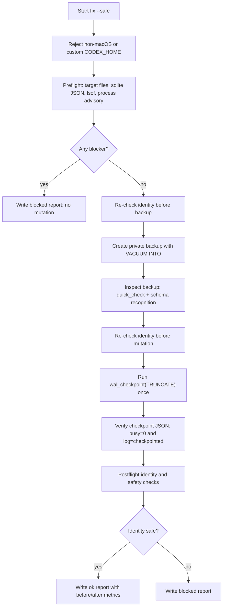

# AIDM Reviewer Brief

This document explains the current design and implementation of `ai-dev-maintenance` for external technical review.

`ai-dev-maintenance` is also exposed as the short CLI command `aidm`.

Current package version: `0.1.5`

## 1. Purpose

`ai-dev-maintenance` is a small macOS CLI for diagnosing and safely reclaiming local disk usage caused by AI coding tool state.

The current v0.1.x implementation is intentionally narrow. It focuses on one concrete maintenance target:

- the default Codex SQLite log database at `<home>/.codex/logs_2.sqlite`;
- its SQLite sidecar files, `<home>/.codex/logs_2.sqlite-wal` and `<home>/.codex/logs_2.sqlite-shm`;
- safe WAL checkpoint/truncate after a verified private backup.

The tool is designed for users who notice that AI coding tools appear to make their machine slower over time, but who should not be expected to understand SQLite WAL files, open handles, backup validation, or safe database maintenance.

The main product goal is:

> Provide a conservative "doctor first, fix only when safe" workflow that helps users understand local Codex log storage pressure without risking chat/session loss.

## 2. Non-Goals

The v0.1.x scope deliberately excludes many tempting cleanup features.

The tool does **not**:

- delete log rows;
- delete chat/session history;
- inspect or print log contents;
- upload any local data;
- edit Codex configuration;
- edit Claude Code or other AI tool data;
- install SQLite triggers;
- run full `VACUUM`;
- force-close, kill, restart, suspend, or control Codex;
- perform daemon/background monitoring;
- run automatic cleanup while Codex is open;
- support platforms other than macOS.

This conservative scope is intentional. The primary failure to avoid is corrupting or losing a user's AI coding session state.

## 3. Intended Users

Primary users:

- non-specialist users running AI coding tools daily;
- users comfortable pasting a terminal command but not necessarily comfortable debugging SQLite;
- developers who want a quick local diagnosis before manually inspecting disk usage;
- maintainers reviewing whether the safety model is strict enough for public distribution.

Reviewer assumptions:

- Reviewers should treat this as a local maintenance utility that touches private developer-machine state.
- The security and data-loss posture matters more than aggressive disk recovery.
- False blocking is acceptable. Unsafe cleanup is not.

## 4. Public Interface

### Guided Mode

```bash
npx --yes ai-dev-maintenance@0.1.5
```

When run in a normal interactive terminal with no explicit subcommand, the CLI starts guided mode.

Guided mode:

1. prints a small terminal banner unless suppressed;
2. runs `doctor`;
3. explains whether cleanup is currently safe;
4. if blocked, offers safe choices such as wait, re-check, show report command, or quit;
5. if ready, asks `Clean now? [y/N]`;
6. only calls `fix --safe` after an explicit `y` / `yes`.

### Short Command

After global install:

```bash
npm install -g ai-dev-maintenance@0.1.5
aidm
```

### Display-Only Logo

```bash
aidm logo
aidm logo --plain
```

`logo` prints only the banner. It does not run diagnostics, create reports, read the Codex database, or touch the filesystem.

### Static Diagnosis

```bash
aidm doctor
aidm doctor --json
aidm doctor --show-paths
aidm doctor --no-banner
```

`doctor` is diagnostic. It writes a redacted local report under `<home>/.ai-dev-maintenance/reports`.

### Safe Fix

```bash
aidm fix --safe --yes
```

`fix --safe --yes` is the only mutating maintenance command in v0.1.x.

It may:

- create a private local backup;
- run SQLite WAL checkpoint/truncate;
- write a redacted local report.

It may not:

- run unless all safety checks pass;
- proceed while the target database is open by any process;
- treat a Codex-like process name by itself as a blocker;
- mutate database rows, schema, triggers, or configuration.

### Report Review

```bash
aidm report --latest
aidm report --latest --show-paths
```

`report --latest` reads the most recent redacted report after validating that the report file is safe to read.

### Backup Validation

```bash
aidm restore validate --backup <path>
```

This validates a backup for recovery planning. It does not restore automatically.

## 5. Current Data Model

Reports use schema version `1`.

Top-level report fields:

```ts
type MaintenanceReport = {
  schemaVersion: 1;
  toolVersion: string;
  generatedAt: string;
  command: string;
  status: 'ok' | 'partial' | 'blocked' | 'unsupported' | 'error';
  redacted: true;
  target: {
    kind: 'default-codex-log-db' | 'unknown';
    pathCategory: string;
  };
  findings: Record<string, unknown>;
  metrics: Record<string, unknown>;
  blockedReasons: string[];
  nextSafeAction?: string;
};
```

Reports are redacted by design. Redacted output removes or avoids:

- raw stdout/stderr;
- absolute local paths;
- raw file identities such as device id, inode, uid, gid, mode, mtime, and realpath;
- log contents;
- session contents.

The report may include high-level information such as:

- whether target files exist;
- whether target files are regular files;
- whether target files are symlinks;
- file sizes;
- blocked reasons;
- WAL bytes before/after cleanup;
- reclaimed bytes.

## 6. Filesystem Scope

### Default Codex Target

The default target triple is:

```text
<home>/.codex/logs_2.sqlite
<home>/.codex/logs_2.sqlite-wal
<home>/.codex/logs_2.sqlite-shm
```

`CODEX_HOME` is supported for diagnostic path discovery, but v0.1.x rejects custom `CODEX_HOME` for `fix --safe`.

Rationale:

- custom paths increase the chance of surprising writes;
- v0.1.x optimizes for the common default Codex installation;
- diagnosis can still show that a custom path was detected.

### Tool Data Directory

The tool writes under:

```text
<home>/.ai-dev-maintenance/
```

Subdirectories:

- `reports/` for redacted local JSON reports;
- `backups/` for private backup work directories created by `fix --safe`.

Directory safety checks reject unsafe app-data paths/components:

- symlink;
- not owned by the current user;
- group/other writable;
- group/other permission exposure for private app directories;
- non-directory where a directory is expected.

Reports are written with `flag: 'wx'` and mode `0600`.

Retention:

- reports keep the newest 50 files and files within the last 30 days;
- backups keep the newest 3 generations and generations within the last 14 days;
- the backup created by the current successful `fix --safe` run is never pruned by that same run;
- manual pruning is available through `aidm reports prune --yes` and `aidm backups prune --yes`;
- pruning only targets strict tool-owned names and skips unsafe entries such as symlinks, wrong-owner paths, and group/other-writable paths.

## 7. Safety Model

The safety model is "fail closed".

If the tool cannot confidently prove that cleanup is safe, it blocks.

### Target File Checks

For the main database and existing sidecar files, the tool checks:

- file exists where required;
- regular file;
- not a symlink;
- not hard-linked;
- owned by current user;
- not group/other writable.

If any of these fail, `fix --safe` blocks.

### Directory Chain Checks

Before mutation, the parent directory chain around the target is checked for:

- symlink components;
- non-current-user ownership;
- group/other writable permissions.

Failures block `fix --safe`.

### Open Handle Checks

The tool uses trusted `/usr/sbin/lsof` with the target triple to detect open handles.

If `lsof`:

- times out;
- has truncated output;
- returns permission errors;
- returns nonzero stderr;
- is otherwise unusable;

then cleanup blocks.

If any process has the main database, WAL, or SHM open, cleanup blocks.

### Process Checks

The tool uses trusted `/bin/ps` only for advisory Codex-process detection.

In v0.1.5, a Codex-like process name by itself does not block cleanup. Cleanup readiness is decided by target file safety, open handles on the target database/WAL/SHM, and SQLite checkpoint results. This avoids false blocking from helper processes, app wrappers, editors, or command lines that merely contain Codex-like text.

If process-list output is truncated or unavailable, the advisory field may be `unknown`, but this does not override the open-handle based safety decision.

### SQLite Command Checks

The tool uses trusted `/usr/bin/sqlite3`.

The binary must:

- be the expected system path;
- be owned by root;
- not be a symlink;
- not be group/other writable.

SQLite invocations:

- use `shell: false`;
- pass a restricted `PATH`;
- run with an isolated temporary `HOME`;
- pass `-init /dev/null`;
- use SQLite `file:` URIs with explicit `mode=ro` or `mode=rw`;
- never pass plain database paths to SQLite helpers.

### Output Truncation

Command runner stdout/stderr are capped.

If critical checks depend on command output and that output is truncated, the operation is treated as unsafe and blocks.

## 8. `doctor` Flow

`doctor` is designed to be low-risk.

On macOS it:

1. resolves the default Codex target path;
2. collects safe target file metadata through `lstat`;
3. checks whether `sqlite3 -json` is available;
4. runs `lsof` against existing target files;
5. records advisory Codex-process information through `ps`;
6. derives `fixReadiness`;
7. writes a redacted report.

Important behavior:

- `doctor` does not open the source database as a SQLite connection;
- `doctor` skips SQLite content inspection in v0.1.x to avoid copying private log bytes;
- `doctor` can complete even when Codex is open;
- `doctor` may report that `fix --safe` is not ready.

## 9. `fix --safe` Flow

`fix --safe --yes` is the mutating path.

It follows this sequence:



### Backup Creation

Backup creation:

- creates a private work directory under `<home>/.ai-dev-maintenance/backups`;
- runs `VACUUM INTO` to a temporary file;
- chmods the temporary backup to `0600`;
- validates the backup with `PRAGMA quick_check`;
- verifies that the schema looks like the supported Codex logs schema;
- atomically renames the temporary backup to the final backup path;
- writes a private manifest.

If backup creation fails, the temporary work directory is removed.

### Identity Drift Checks

The tool captures and compares target identities at multiple points.

Before backup and before mutation, it requires stable identity for:

- existence;
- regular-file status;
- symlink status;
- device;
- inode;
- hard-link count;
- mode;
- uid;
- gid;
- size;
- mtime.

After mutation, it still requires the same file identity, but permits expected size/mtime changes for the main database and sidecar files.

### WAL Checkpoint

The only database maintenance operation is:

```sql
PRAGMA busy_timeout=0;
PRAGMA wal_checkpoint(TRUNCATE);
```

The checkpoint result is parsed from SQLite JSON output and accepted only when:

- exactly one result row is returned;
- `busy` is numeric and `0`;
- `log` and `checkpointed` are finite numbers;
- `log === checkpointed`.

If the checkpoint is busy, malformed, truncated, or nonzero exit, the operation blocks. A nonzero WAL file size after a successful checkpoint is recorded as a warning/metric rather than turning a successful checkpoint into a blocked result.

After the checkpoint, v0.1.5 does not re-run full `lsof`/`ps` preflight as a success condition. It validates target safety and identity drift instead, so an advisory process-list change after mutation cannot incorrectly flip a completed checkpoint to blocked.

## 10. CLI UX Behavior

v0.1.5 adds visual polish without changing safety semantics.

Guided mode shows:

- a small `AIDM` hero banner on capable terminals;
- a short statement that AIDM does not delete chats or touch Codex while open;
- `Paused for safety` when Codex or open handles are detected;
- `Ready to clean` only when readiness checks are safe;
- `Expected cleanup: WAL checkpoint/truncate only.`;
- explicit confirmation before cleanup.

Banner suppression:

- `--no-banner` suppresses the banner in guided/static human output;
- `--plain` disables ANSI color;
- `NO_COLOR=1` disables ANSI color;
- `CI` and non-TTY contexts avoid interactive/banner behavior;
- `doctor --json` never includes banners or human-only text.

## 11. Dependency and Packaging Model

Runtime:

- Node.js `>=20`;
- no runtime npm dependencies;
- macOS system commands: `/usr/bin/sqlite3`, `/usr/sbin/lsof`, `/bin/ps`.

Development dependencies:

- TypeScript;
- tsup;
- Vitest;
- Node type definitions.

Package lifecycle:

- no install-time lifecycle scripts;
- `prepack` runs verify/build/package hygiene;
- `prepublishOnly` runs verify/build/package hygiene/release check.

Published package files:

- `dist`;
- `README.md`;
- `README.ja.md`;
- `SECURITY.md`;
- `LICENSE`;
- `examples`.

## 12. Test Coverage

The current test suite covers:

- CLI routing and output;
- guided interactive flow;
- banner rendering and suppression;
- fix-scope constraints;
- disposable macOS SQLite WAL fixture e2e for `fix --safe`;
- filesystem safety checks;
- command safety;
- privacy/redaction behavior;
- release checks;
- public hygiene checks.

At the time v0.1.5 was released, the verification command was:

```bash
corepack pnpm run verify
```

This runs:

```bash
pnpm run typecheck
pnpm run test
pnpm run hygiene
```

The v0.1.5 release also passed:

```bash
corepack pnpm run build
corepack pnpm run release:check
npm publish --dry-run --access public
```

## 13. Privacy Posture

The tool is intended to be safe to run on machines containing private AI coding sessions.

Privacy properties:

- no telemetry;
- no CLI-time network calls after the npm package has started;
- no log-content printing;
- no database row inspection in `doctor`;
- redacted reports only;
- raw command output removed from reports;
- absolute paths redacted to categories such as `<home>` or `<absolute-path>`.

Known privacy tradeoff:

- `fix --safe` creates a private local backup that may contain Codex log data.

This backup is local-only, private-permissioned, and created before mutation. The backup is necessary so that a safe recovery path exists if SQLite maintenance fails or exposes an unexpected issue.

## 14. Known Limitations

v0.1.x limitations:

- macOS only;
- targets only the default Codex log DB;
- does not shrink the main SQLite database file;
- does not clean Claude Code data;
- does not support custom cleanup policies;
- does not run as a background monitor;
- does not automatically close tools;
- can block even when a human believes cleanup would be safe;
- requires system `sqlite3`, `lsof`, and `ps` at expected paths;
- does not provide automated restore.

The most important product limitation is that users may need to close Codex before cleanup can run. This is intentional because live database handles are treated as unsafe.

## 15. Reviewer Focus Areas

External reviewers should focus especially on the following questions.

### Data Loss Risk

- Can `fix --safe` ever mutate the wrong file?
- Are symlink, hard-link, ownership, and permission checks sufficient?
- Are identity drift checks strict enough?
- Is rejecting custom `CODEX_HOME` for mutation the right v0.1.x choice?
- Is backup validation sufficient before checkpoint?

### SQLite Correctness

- Is `VACUUM INTO` an appropriate backup mechanism here?
- Is `wal_checkpoint(TRUNCATE)` safe under the current preconditions?
- Is running checkpoint once with strict JSON validation sufficient?
- Is checking `busy === 0` and `log === checkpointed` sufficient?
- Are there SQLite edge cases around WAL/SHM disappearance or recreation that should be handled differently?

### Process/Open-Handle Detection

- Is `lsof` classification conservative enough?
- Are process-name patterns for Codex too broad or too narrow?
- Could false positives degrade usability too much?
- Could false negatives permit unsafe cleanup?

### Privacy and Reporting

- Does the redaction model exclude all sensitive local identifiers?
- Are report fields too detailed for a tool intended for non-expert users?
- Is keeping local backup manifests acceptable?
- Should reports include less, more, or differently structured information?

### CLI UX

- Does guided mode explain blocked cleanup clearly enough?
- Is the `aidm` short command intuitive?
- Is `--yes` sufficiently explicit?
- Should the tool offer an interactive wait loop by default, or only when selected?
- Is the banner professional enough for a safety-oriented CLI?

### Supply Chain

- Is no-runtime-dependency a useful constraint?
- Are package lifecycle scripts appropriate?
- Should releases include additional provenance artifacts?
- Should the tarball include or exclude examples?

## 16. Suggested Manual Review Commands

Clone and inspect:

```bash
git clone <repository-url>
cd ai-dev-maintenance
corepack pnpm install
corepack pnpm run verify
corepack pnpm run build
```

Inspect package contents:

```bash
npm pack --dry-run
```

Run non-mutating commands:

```bash
node dist/cli.js logo --plain
node dist/cli.js doctor --json
node dist/cli.js report --latest
```

Run the mutating path only on a disposable test fixture or a machine state where closing AI coding tools and creating a local private backup is acceptable:

```bash
node dist/cli.js fix --safe --yes
```

## 17. Design Principle Summary

The current design prioritizes:

1. no session loss;
2. no hidden data exfiltration;
3. explicit local backup before mutation;
4. fail-closed safety checks;
5. small, understandable CLI surface;
6. enough UX polish for non-specialist users without weakening the safety model.

The intended reviewer verdict is not "does this reclaim every possible byte?" but:

> Is this narrow maintenance operation safe, understandable, and appropriately conservative for public use?
